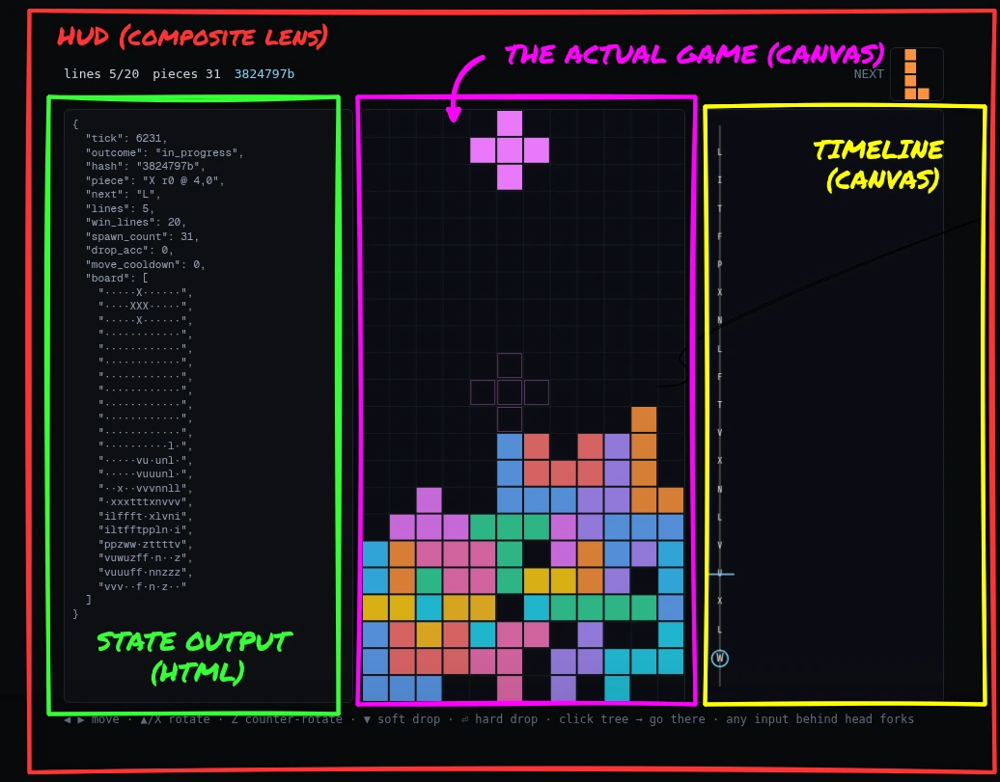

# el coso - a digital terrarium

A deterministic engine for small simulated worlds, no render contract, just a pure function evolving a state.

## The core idea

A world is a **state** plus one **pure step**:

```
(state, inputs, rng) → (state, rng)
```

No wall clock, no `Math.random()`, no hidden globals, no I/O, no nada.

That single constraint is what makes everything else free: because a run is 
fully determined by its seed and its input log, the engine can reconstruct 
**any** past moment bit-exact, branch the timeline, and replay the whole thing.

Our rules:

- **No magic.** Every behavior is explicit in the data. A step reads only
  its state, inputs, config, and RNG — no surprises, no hidden coupling.
- **The world doesn't help.** The engine never hints, validates, or
  surfaces structure for you. What you learn about a world, you learn by
  watching it run. Looking is free; knowing costs an experiment.

## How it fits together

```
host        runs the loop + transport — a react-less embed (common), the
            full React editor (inspector + git-tree timeline), or headless
lens        renders a world, translates your input, owns the cadence
history     input log + keyframes + branch tree → bit-exact replay
engine      double-buffered state, seeded RNG, one pure tick — no clock
substrate   a world: state plus one pure step, nothing else
```

A **substrate** is a self-contained world, plugged in through one
three-function bundle (`alloc` / `initState` / `tick`). The engine is
deliberately small: it allocates, steps, and swaps — *when* to tick is the
lens's decision, so the same world is turn-based through one lens and
real-time through another.

Three things every world gets for free:

- **Time travel** — rewind, branch, and replay in a git-style timeline tree (this feature is called BTTF, back-to-the-future).
- **Swappable lenses** — one world, many views/renders (Canvas2D, WebGL, DOM, ASCII, etc), each lens discards something on purpose to make some structure legible (what the world **is** and what the **lens renders** are two different things).
- **Nesting** — a world can suspend, run another world to an outcome, absorb the result, and keep the inner run inspectable (the pokemon/jrpg battle style).

The full tour is [`docs/guide.md`](docs/guide.md).

## Some screenshots because they look cool




> Pentris implementation showing the lens composition with different render targets

## Run it

Requires Node.js 20+.

```bash
npm install
npm run dev    # http://localhost:5173 — substrate picker in the toolbar
npm test
```

## Make a world

```bash
npm run new-substrate
```

A simple wizard with six design questions that scaffolds a green, registered
package — no boilerplate, nothing to wire by hand (just start coding).

See [`docs/guide.md`](docs/guide.md#scaffold-a-new-substrate).

## Export an embed

```bash
npm run export -- <substrate-id>
```

Builds a self-contained, single-file HTML at `dist-embed/<id>/<id>.html`.

To mount and drive **many** embeds from one host page — play/pause,
tunables, named commands, a global autoplay policy, and host controls that
stay in sync with the substrate — there's a small host SDK (`createConductor`).

See [`docs/embedding.md`](docs/embedding.md).

## AI Disclaimer / Inspirations

This project used Claude Code to scaffold the project structure and to run the implementations of some specifics substrates. 

No generated art was used. This document was mostly written by hand, with the docs/guide being 100% authored by Claude.

## License

MIT — see [LICENSE](LICENSE).
